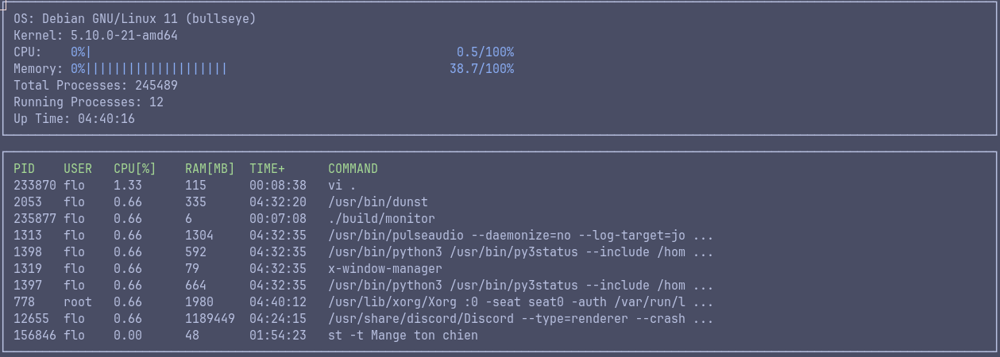

## CppND-System-Monitor

This repo is a clone of the [System Monitor Project](https://github.com/udacity/CppND-System-Monitor) with my solution for the C++ Nanodegree project 2.

The purpose is to create a program as 'htop'. It has to display the following information about the system :
- The OS / Kernel version.
- The current CPU usage.
- The amount of memory usage.
- The number of forks since boot and the number of processes in runnable state.
- The up time.
- A list of processes with their information, sorted by their cpu usage.

### Dependencies
[Ncurses](https://www.gnu.org/software/ncurses/) is a library that facilitates text-based graphical output in the terminal. 
This project relies on ncurses for display output.  
Install ncurses within your own Linux environment:  

    sudo apt install libncurses5-dev libncursesw5-dev

### Make
This project uses [Make](https://www.gnu.org/software/make/). The Makefile has four targets:
* `build` compiles the source code and generates an executable
* `format` applies [ClangFormat](https://clang.llvm.org/docs/ClangFormat.html) to style the source code
* `debug` compiles the source code and generates an executable, including debugging symbols
* `clean` deletes the `build/` directory, including all of the build artifacts

### Install

1. Clone the project repository: `https://github.com/FLinguenheld/CppND-System-Monitor`
2. Build the project: `make build`
3. Run the resulting executable: `./build/monitor`

### Sources

To understand the CPU calculations, I used the *proc* man pages and several sources as below :  
- [CPU](https://stackoverflow.com/questions/23367857/accurate-calculation-of-cpu-usage-given-in-percentage-in-linux)  
- [CPU usage per process](https://stackoverflow.com/questions/1420426/how-to-calculate-the-cpu-usage-of-a-process-by-pid-in-linux-from-c)
